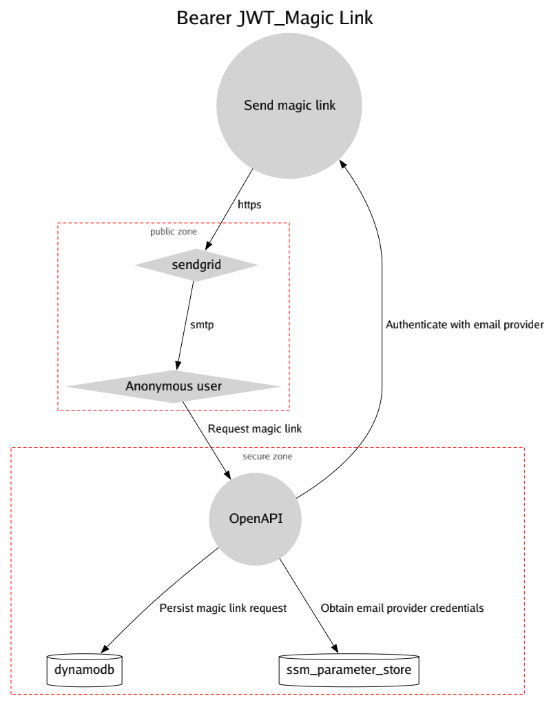
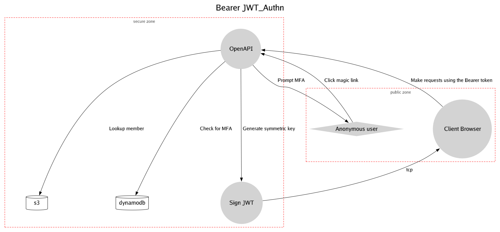
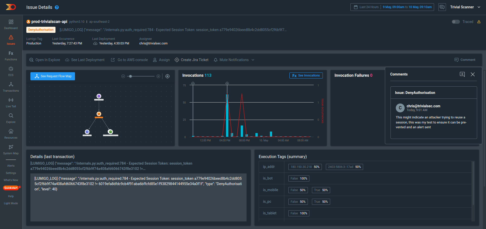

# Bearer JWT

Author: [Chris Langton](https://github.com/0x73746F66)

## Overview

Trivial Security Open API relies on it's Bearer JWT with a symmetric signature that is exposed to the Dashboard front-end for it's cookie-free web session

See more: <https://docs.trivialsec.com>

| Attributes      |        |
| --------------- | ------ |
| Internet Facing | ✅     |
| New Initiative  | ✅     |
| Initiative Size | Medium |

## Use Cases

- **Opaque Bearer token as a short lived reference**

Trivial Security has made intentional design choices to restrict the JWT for the use case of; _Reference tokens_ (sometimes also called _opaque tokens_).
The following claims are issued and validated on each evaluation; `nbf`, `iat`, `exp`, `iss`, `aud`, `sub`, and the header `kid` is used to correlate with the token service.

A nice feature of reference tokens is that you have much more control over their lifetime. The downside of reference tokens is having a back-channel communication from resource server to token service (not a stateless server) which is not a design goal for Trivial Security.

This allows for scenarios like; revoking the token in an “emergency” case (users can have emergency also; lost phone, phishing attack etc.), and invalidate tokens at user logout time or app uninstall.

Simply holding the token does not permit it's use on other devices, on the same device outside the context which is was issued, or beyond the short time frames within the permitted browser and device context.
If either client or server has any reason to distrust any token issued for any reason, they are revocable by either which is an immediate global effect, and due to the `kid` and each token having it's own unique signing secret there can be more than 1 token issued per user simultaneously.

## Exclusions

- **Authz Insecure Direct Object Reference (IDOR)**

The only custom claim signed in the JWT is `acc` for our MemberAccount unique human readable name.
It is only read after all validation and verification steps are complete, and it's a non-authoritative
circuit breaker intended to detect issues with data and not provide Authz controls

- **JWT validation on client-side devices**

Using symmetric signing keys, the client would be required to hold the shared secret to verify the
signature and use the JWT.
Sharing this symmetric key with a client breaks the server-side assurance that the JWT provided.
If new custom claim data is needed for a client device to read, it has to read it from the JWT without
doing signature verification (not recommended) and the values should be considered malicious i.e. XSS.

- **Bearer token as an access token**

> A client-side token is a bearer token.

If it becomes compromised, it can be used without restrictions by whoever possesses it. Not having a short lifetime or revocation mechanism in place makes such a scenario extremely vulnerable.
Protocols like OAuth2 and therefore OIDC apply the self-contained token strategy; The recipient of a self-contained token can verify the token signature and validate claims because it has the asymmetric key material (embedded in the JWT) and often referred to as a stateless client-side.
The weakness here is the client has the key material and must apply sensitive data controls, and the issuing server must have abuse monitoring and enforce very short token expiry (5 to 10 minutes), the short lifetime prevents the window of abuse in case an access token is stolen.

The implementation and documentation of Trivial Security will reference the JWT as a Bearer token, when transmitted over the `Authorization` header specifically.
However this is merely convention, to provide a documentation-as-code that will have linkage to JWT libraries and blog post.

## Information Assets

### Customer data [Confidential]

Customer data is stored in S3 and available via the OpenAPI

### Credential Store [Confidential]

DynamoDB stores a per-session symmetric key for JWT signing and validation

## Threat Scenarios

### Threat

Stolen token used on attacker controlled device or tools

> Impact Type: Integrity

> STRIDE: Spoofing

Impacted Information Assets:

- Customer data

#### Controls

##### Stolen access tokens

> Implemented: ✅

Access tokens should not be able to be used on any other device than the fingerprinted device at time of Authn.

See [access token reuse](#access-token-reuse) for a longer use case and example that incorporates this control into it's scenario.

_Implementation Notes_

kid is a sha224 that incorporates end-user fingerprinting and internal primary key

| Attributes     |        |
| -------------- | ------ |
| Risk Reduction | 50     |
| HashAlgo       | sha224 |

##### Asymmetric signature with Certificate based public key exchange

> Implemented: ❌

This is theoretically a stronger Bearer JWT implementation and may provide stronger assurance

| Attributes     |                                                            |
| -------------- | ---------------------------------------------------------- |
| Risk Reduction | 10                                                         |
| Roadmap        | Not being tracked, control has been validated as effective |

### Threat

Stolen token is used on another client/browser

> Impact Type: Integrity

> STRIDE: Spoofing

Impacted Information Assets:

- Customer data

#### Controls

##### Access token reuse

> Implemented: ✅

Access tokens should not be able to be used outside the context of the client/browser fingerprinted at time of Authn.
A session token never leaves the server, and each request is default treat unauthenticated until the server can derive what the session token is and verify it's status from the credential store state.

Below is an example of an attacker using a stolen JWT, which is not expired, revoked, modified, or considered invalid in any other way from the client side:

As shown, the server compared session tokens and denied the request.

Both session tokens were derived on the server, neither was provided by the client.
The client merely provided the `kid` claim that us used to lookup the stored session, which is not considered to be the session for this request yet..

The first session token is stored with the session data on the server and never sent to the client.
The second session token is derived on the server at the time of request independent of the stored session using nothing provided by the JWT, the JWT is merely there is ensure the authenticated legitimate client knows it's `kid`, and if it sends it back we trust it due to the symmetric signature integrity verification utilising a symmetric key that never left the server.

If the JWT was stolen and a malicious actor attempted to use it outside the context of the client, even if the JWT is integrity check the session token will never match.
If the malicious actor attempts to use the JWT in the same context as the client (the session token matches) the JWT can not be tampered with to modify the `kid` because other `kid` values will not match their correlated session tokens to this client context.
If a malicious actor managed to gain access to the symmetric key for signing a JWT for a client, there is no other claims in the JWT that the application uses.

_Implementation Notes_

kid is a reproducible (on server) hash that incorporates client fingerprinting and internal primary key

| Attributes     |        |
| -------------- | ------ |
| Risk Reduction | 25     |
| HashAlgo       | sha224 |

##### Retrieve browser fingerprint via websocket

> Implemented: ❌

Theoretically an asynchronous socket can gather a wide range of browser identifiers to be incorporated in a fingerprint for the session during Authn

| Attributes     |                                                            |
| -------------- | ---------------------------------------------------------- |
| Risk Reduction | 10                                                         |
| Roadmap        | Not being tracked, control has been validated as effective |

### Threat

Token tampering (via XSS/CSRF)

> Impact Type: Confidentiality,

> STRIDE: Tampering

Impacted Information Assets:

- Customer data

#### Controls

##### Access token reuse

> Implemented: ✅

The server-side should reject the token if any claim or header was changed by the client

_Implementation Notes_

symmetric key for signature validation never leaves the context of the server, all tokens (Authorization header and cookie) are validated

| Attributes     |       |
| -------------- | ----- |
| Risk Reduction | 50    |
| SignatureAlgo  | HS256 |

##### Non-repudiation

> Implemented: ✅

Log all Authentication attempts, include all possible client indicators and fingerprints

_Implementation Notes_

See [access token reuse](#access-token-reuse) for an example that incorporates this control into it's scenario.

| Attributes     |     |
| -------------- | --- |
| Risk Reduction | 100 |

### Threat

Signing secret exposed

> Impact Type: Confidentiality

> STRIDE: Info Disclosure, Elevation Of Privilege

Impacted Information Assets:

- Customer data
- Credential Store

#### Controls

##### Secret rotation

> Implemented: ✅

A secret should be short-lived

_Implementation Notes_

symmetric key for signature validation will rotate with each new session, last for 24h, and if revoked in the credential store the user is logged out and must re-Authn

| Attributes     |     |
| -------------- | --- |
| Risk Reduction | 50  |

##### Secret revocation

> Implemented: ✅

A secret should be revocable so the user should be required to re-Authn

_Implementation Notes_

If sessions are revoked in the credential store, or by the user in the Security page, the user is logged out and must re-Authn

| Attributes     |     |
| -------------- | --- |
| Risk Reduction | 25  |

##### Forced re-Authn

> Implemented: ❌

Instead of users being logged out and redirected to the homepage, an re-Authentication UX should be shown

| Attributes     |                       |
| -------------- | --------------------- |
| Risk Reduction | 10                    |
| Roadmap        | In progress; designed |

## Third Party Dependencies

### AWS DynamoDB

DynamoDB stores member session data and FIDO/PassKey configuration

AWS DynamoDB is a SaaS product that we (the company) pays for.

AWS DynamoDB is an infrastructure product.

> Uptime Classification: HARD

This dependency is tightly coupled to most usage of the product and could potentially create a large or total outage.
If this dependency goes down users can't login

---

Created: 2023-04-20 - Updated: 2023-04-20
